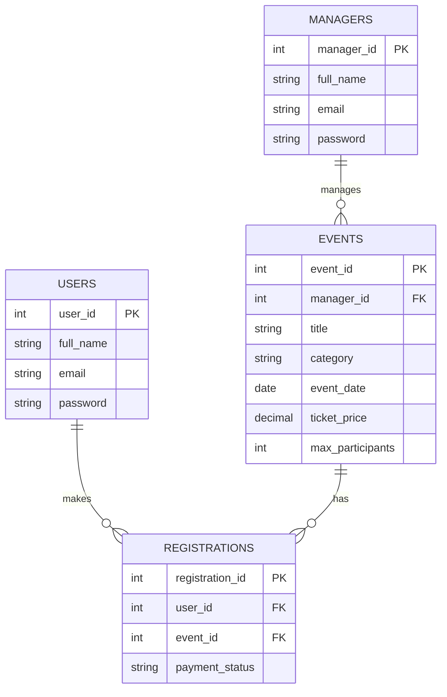

# LocalLoop — Local Event Portal

**Part 2 of 4: Core Features.** Continues directly from Part 1 — nothing
below was restarted. Part 1 gave the project auth for Users and Managers
and a static homepage; Part 2 adds the Manager Dashboard, full Event CRUD,
and wires the homepage to real data.

## Tech stack

- **Frontend:** HTML5, Tailwind CSS (via CDN), vanilla JavaScript
- **Backend:** Node.js, Express.js (MVC-style: routes → controllers → models)
- **Database:** MySQL
- **Auth:** JWT + bcrypt password hashing

## 1. Install prerequisites

You only need to do this once per computer.

| Tool | Why | Link |
|---|---|---|
| Node.js (LTS) | Runs the server | https://nodejs.org |
| MySQL Server | Stores the data | https://dev.mysql.com/downloads/mysql/ |
| MySQL Workbench | Run the schema visually (optional but easier) | https://dev.mysql.com/downloads/workbench/ |
| Git | Version control | https://git-scm.com |
| VS Code | Editor | https://code.visualstudio.com |
| Postman | Test API endpoints directly | https://www.postman.com/downloads/ |

## 2. Project setup

```bash
# from inside the local-event-portal folder
npm install
```

Copy the environment template and fill in your own values:

```bash
cp .env.example .env
```

Set `DB_PASSWORD` to your real MySQL password, and replace `JWT_SECRET`
with a random string — generate one with:

```bash
node -e "console.log(require('crypto').randomBytes(64).toString('hex'))"
```

## 3. Create the database

Run the whole `database/schema.sql` file in MySQL Workbench (or the
`mysql` CLI) — unchanged since Part 1. It already includes the `events`
table that Part 2's API now reads and writes.

## 4. Run the server

```bash
npm run dev
```

Open **http://localhost:5000** — not by double-clicking the HTML files.

## 5. Add real images (optional)

See `public/images/README.md`. Every image spot has a warm color
fallback, so the site looks intentional either way.

---

## What Part 2 adds

- **Event CRUD API** (`models/eventModel.js`, `controllers/eventController.js`,
  `routes/eventRoutes.js`) — full Create / Read / Update / Delete for events,
  mounted at `/api/events` in `server.js`.
- **Manager Dashboard** (`public/dashboard.html` + `public/js/dashboard.js`) —
  a manager's private page to create, edit, and delete their own events.
- **Homepage wired to real data** — `public/js/main.js` now calls
  `GET /api/events` instead of only reading static sample data.
- **Event Categories in the real flow** — the create/edit form's Category
  field is a dropdown locked to the same five values as the database's
  `ENUM`, and every card's category tag now comes from real event rows.
  (Actually *filtering* the homepage by category is Part 3's job.)

### How the dashboard works

1. `dashboard.js` checks `localStorage` for a token and `role === 'manager'`
   on page load. If either is missing, it redirects to `/login.html`.
   **This check is UX only** — the real security boundary is
   `authorize('manager')` on the server, which verifies the JWT itself.
   Editing `localStorage` in devtools could fool the redirect, but it
   can't fool the API.
2. `GET /api/events/mine` returns only events owned by the logged-in
   manager (matched by the `id` inside their JWT, not anything the
   browser sends).
3. One `<form>` handles both **Create** and **Update** — clicking "Edit"
   on a row fills the same form and switches it into edit mode; clicking
   "+ New Event" clears it back to create mode. This avoids maintaining
   two nearly-identical forms.
4. "Delete" asks for confirmation, then calls `DELETE /api/events/:id`.
   The controller checks the event's `manager_id` against the JWT's `id`
   before allowing it — a manager can never delete another manager's event,
   even by guessing the URL.

### Why events don't have a "rating" field in the dashboard form

The brief intentionally excludes a review system — the database stores
one `rating` value per event for display, but nothing in the app computes
or collects it from users. Letting a manager type in their *own* star
rating didn't make sense (nobody rates their own event), so new events
default to `0`, which the homepage displays as **"New"** instead of a
misleading "★ 0.0" — a small UI decision, not a missing feature.

### Homepage fallback behavior

`public/js/main.js` still keeps `sample-data.js` around, but only as a
fallback if the `/api/events` request itself fails (e.g. the server
restarted mid-session). If the request *succeeds* but returns zero events
— a perfectly normal state for a brand-new database — the homepage shows
an honest empty state ("No events posted yet — register as a manager…")
instead of pretending there's content. Try it: on a fresh database, the
homepage will show that empty state until you register as a manager and
create your first event from the dashboard.

## How it's built

### Architecture

```
Browser (HTML + vanilla JS)
     │  fetch('/api/...')
     ▼
Express server (server.js)
     │
     ├─ routes/        → which URL maps to which controller function
     ├─ middleware/     → runs before the controller (auth checks, errors)
     ├─ controllers/    → the actual logic for each request
     └─ models/         → the only files that talk to MySQL
                              │
                              ▼
                         MySQL database
```

Part 2 slots `eventModel.js` / `eventController.js` / `eventRoutes.js`
into this same structure — no new layers, no new patterns to learn.

### Database design

Four tables, two relationships (unchanged since Part 1 — `events` and
`registrations` were designed up front):

- One **manager** owns many **events** (1:N)
- One **user** can register for many **events**, and one **event** can
  have many **users** register — a many-to-many, resolved with a
  **registrations** join table (still unused until Part 3).



### Authentication flow

1. Register/login hashes the password with **bcrypt** and returns a
   **JWT** containing `{ id, role }`, signed with `JWT_SECRET`.
2. The browser stores that token in `localStorage`, sending it back as
   `Authorization: Bearer <token>` on requests that need to know who's
   asking.
3. `authorize('user')` / `authorize('manager')` on each route checks the
   token carries the *right* role — a user's token can never reach a
   manager-only route, and vice versa.
4. Part 2 adds one more layer on top of role: **ownership**. Being *a*
   manager is enough to create events; being *the* event's manager is
   what `updateEvent`/`deleteEvent` additionally check
   (`existing.manager_id !== req.user.id`) before allowing a change.

### Frontend notes

- Tailwind loads from the CDN with one shared config
  (`public/js/tailwind-config.js`) — no build step.
- `login.html`/`register.html` remain one shared form per page for both
  roles (unchanged from Part 1).
- `dashboard.html` reuses the exact same nav markup and element IDs as
  `index.html`, so `main.js` (login state, mobile menu, logout) works on
  it without any modification — only `dashboard.js` is dashboard-specific.
- `main.js`'s `createEventCard()` is now used against **real** API rows
  instead of only static data — the function didn't need to change
  shape because `sample-data.js` was updated to match the API's field
  names (`event_date`, `ticket_price`) ahead of time back in Part 1's
  handoff to Part 2.

## API reference

| Method | Endpoint | Body | Auth required | Description |
|---|---|---|---|---|
| POST | `/api/users/register` | `fullName, email, password` | — | Create a user account |
| POST | `/api/users/login` | `email, password` | — | Log in, returns a JWT |
| GET | `/api/users/profile` | — | Bearer token (user) | Get the logged-in user |
| POST | `/api/managers/register` | `fullName, email, password` | — | Create a manager account |
| POST | `/api/managers/login` | `email, password` | — | Log in, returns a JWT |
| GET | `/api/managers/profile` | — | Bearer token (manager) | Get the logged-in manager |
| GET | `/api/events` | — | — | List every event (public) |
| GET | `/api/events/:id` | — | — | Get one event (public) |
| GET | `/api/events/mine` | — | Bearer token (manager) | List only *your* events |
| POST | `/api/events` | title, category, eventDate, eventTime, location, organizer, ticketPrice, maxParticipants, description?, image? | Bearer token (manager) | Create an event |
| PUT | `/api/events/:id` | same as POST | Bearer token (manager), must own it | Update an event |
| DELETE | `/api/events/:id` | — | Bearer token (manager), must own it | Delete an event |
| GET | `/api/health` | — | — | Confirms the server + DB are up |

## How to test it

**In the browser:** register as a manager, you'll land on the homepage
with a **Dashboard** link in the nav (users don't see this link). Open
it, click **+ New Event**, fill in the form, and submit — it should
appear both in "Your Events" on the dashboard *and* on the public
homepage. Try **Edit** and **Delete** on it too.

**In Postman**, after logging in as a manager and copying the token:
1. `POST http://localhost:5000/api/events` with header
   `Authorization: Bearer <token>` and a JSON body containing all
   required fields → expect `201` with the created event.
2. `GET http://localhost:5000/api/events` (no auth needed) → your new
   event should be in the list.
3. `PUT http://localhost:5000/api/events/<id>` → update it.
4. Log in as a *different* manager and try `DELETE` on the first
   manager's event ID → expect `403`, confirming ownership checks work.

## Common beginner mistakes

*(Carried over from Part 1, plus what's new this part.)*

- **Forgetting to copy `.env.example` to `.env`.**
- **"Access denied" from MySQL** — wrong `DB_PASSWORD`.
- **"Table doesn't exist"** — `schema.sql` wasn't run.
- **Postman 401 "no token provided"** — header must be exactly
  `Authorization: Bearer <token>` (with the space).
- **New: registering `/mine` after `/:id` in `eventRoutes.js`.** If you
  add more manager-specific routes later, always put the specific path
  (`/mine`) above the generic one (`/:id`) — Express matches top to
  bottom, and `/:id` would otherwise swallow `/mine` as if "mine" were
  an event ID.
- **New: assuming the dashboard redirect *is* the security.** It isn't —
  it's just a convenience. The real check is `authorize('manager')` on
  the server; test this by trying a manager-only endpoint in Postman
  with a *user's* token and confirming you get `403`.
- **New: a 403 on Edit/Delete that looks like a bug.** If it says "You
  can only edit your own events," that's the ownership check working
  correctly — you're logged in as a different manager than the one who
  created it.

---

## Summary

### Completed in Part 2
- Full Event CRUD API (`GET/POST/PUT/DELETE /api/events`), with manager
  ownership enforced server-side
- Manager Dashboard: create, edit, and delete your own events from one
  reusable form
- Homepage now reads real events from the database, with a graceful
  empty state instead of looking broken on a fresh install
- Category values enforced end-to-end: database `ENUM` → dropdown →
  displayed tag
- Dashboard and homepage both fully responsive (mobile, tablet, desktop)

### Not built yet (by design)
- No Event Details page yet — clicking a card doesn't go anywhere yet
- No search by title or filter by category yet
- No event registration, payment, or calendar export yet
- No production deployment guide, final polish, or viva notes yet

### Coming in Part 3 — Event System
- Event Details page (reusing the existing `GET /api/events/:id`)
- Event Registration (using the `registrations` table from Part 1's schema)
- Search by Title, Filter by Category
- Sandbox/test-mode payment step
- Add-to-calendar via a downloadable `.ics` file or Google Calendar link
